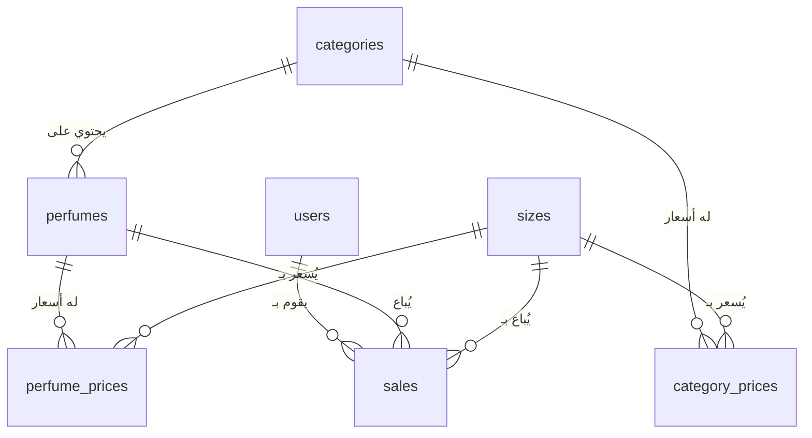

# 🌟 نظام إدارة العطور - عطر التاجوري v2.0

<div align="center">


**نظام إدارة شامل ومتطور لمتاجر العطور مع واجهة عربية حديثة**

</div>

---

## 📋 جدول المحتويات

- [🎯 نظرة عامة](#-نظرة-عامة)
- [⚙️ المتطلبات التقنية](#️-المتطلبات-التقنية)
- [🚀 التثبيت السريع](#-التثبيت-السريع)
- [🗄️ هيكل قاعدة البيانات](#️-هيكل-قاعدة-البيانات)
- [🎨 الواجهات والصفحات](#-الواجهات-والصفحات)
- [🔧 البنية التقنية](#-البنية-التقنية)
- [🔐 نظام الصلاحيات](#-نظام-الصلاحيات)
- [📊 المميزات المتقدمة](#-المميزات-المتقدمة)
- [🛠️ دليل التطوير](#️-دليل-التطوير)
- [📚 مراجع سريعة](#-مراجع-سريعة)

---

## 🎯 نظرة عامة

### 📖 وصف المشروع
نظام إدارة متكامل لمتاجر العطور يوفر حلولاً شاملة لإدارة المخزون، المبيعات، الأسعار، والمستخدمين مع واجهة عربية حديثة ومتجاوبة.

### ✨ المميزات الرئيسية
- 🏪 **إدارة المخزون:** تصنيف وتنظيم العطور بطريقة احترافية
- 💰 **نظام أسعار ذكي:** أسعار متدرجة للعملاء العاديين و VIP
- 📈 **تتبع المبيعات:** إحصائيات مفصلة مع تتبع البائعين
- 👥 **إدارة المستخدمين:** نظام صلاحيات متقدم
- 📊 **تقارير تفاعلية:** تصدير وتحليل البيانات
- 🎨 **واجهة عربية:** تصميم حديث ومتجاوب

### 🎯 الجمهور المستهدف
- أصحاب متاجر العطور
- مديري المبيعات
- البائعين والموظفين
- محاسبي المتاجر

---

## ⚙️ المتطلبات التقنية

### 🖥️ متطلبات الخادم
| المكون | الإصدار المطلوب | الوصف |
|--------|-----------------|-------|
| **PHP** | 8.1+ | مع extensions: BCMath, Ctype, Fileinfo, JSON, Mbstring, OpenSSL, PDO, Tokenizer, XML |
| **Laravel** | 11.x | إطار العمل الأساسي |
| **MySQL** | 8.0+ | قاعدة البيانات الرئيسية |
| **Composer** | 2.x | إدارة حزم PHP |
| **Node.js** | 18+ | لأدوات التطوير |
| **NPM** | 9+ | إدارة حزم JavaScript |

### 🌐 متطلبات المتصفح
- Chrome 90+
- Firefox 88+
- Safari 14+
- Edge 90+

### 💾 متطلبات التخزين
- **مساحة القرص:** 500MB كحد أدنى
- **الذاكرة:** 512MB RAM كحد أدنى
- **قاعدة البيانات:** 100MB للبيانات الأساسية

---

## 🚀 التثبيت السريع

### 📦 الطريقة الأولى: التثبيت الجديد

```bash
# 1. إنشاء مشروع Laravel جديد
composer create-project laravel/laravel perfume-system
cd perfume-system

# 2. تثبيت الحزم الإضافية
composer require maatwebsite/excel
composer require barryvdh/laravel-dompdf

# 3. إعداد قاعدة البيانات
cp .env.example .env
php artisan key:generate

# 4. تكوين قاعدة البيانات في .env
DB_CONNECTION=mysql
DB_HOST=127.0.0.1
DB_PORT=3306
DB_DATABASE=hamza_perfumes
DB_USERNAME=root
DB_PASSWORD=

# 5. تشغيل المشروع
php artisan migrate:fresh --seed
php artisan serve
```

### 🔄 الطريقة الثانية: استنساخ المشروع

```bash
# 1. استنساخ المشروع
git clone [repository-url] perfume-system
cd perfume-system

# 2. تثبيت التبعيات
composer install
npm install

# 3. إعداد البيئة
cp .env.example .env
php artisan key:generate

# 4. إعداد قاعدة البيانات
php artisan migrate:fresh --seed

# 5. تشغيل المشروع
php artisan serve
```

### 🐳 الطريقة الثالثة: Docker

```bash
# 1. إنشاء الحاويات
docker-compose up -d

# 2. تثبيت التبعيات
docker-compose exec app composer install

# 3. إعداد قاعدة البيانات
docker-compose exec app php artisan migrate:fresh --seed
```

---

## 🗄️ هيكل قاعدة البيانات

### 📊 مخطط العلاقات (ERD)



### 🗃️ الجداول التفصيلية

#### 👤 جدول المستخدمين (users)
```sql
CREATE TABLE users (
    id BIGINT UNSIGNED AUTO_INCREMENT PRIMARY KEY,
    name VARCHAR(255) NOT NULL COMMENT 'اسم المستخدم الكامل',
    username VARCHAR(255) UNIQUE NOT NULL COMMENT 'اسم المستخدم للدخول',
    email VARCHAR(255) UNIQUE NOT NULL COMMENT 'البريد الإلكتروني',
    password VARCHAR(255) NOT NULL COMMENT 'كلمة المرور مشفرة',
    role ENUM('super-admin', 'admin', 'saler') DEFAULT 'saler' COMMENT 'دور المستخدم',
    created_at TIMESTAMP NULL DEFAULT NULL,
    updated_at TIMESTAMP NULL DEFAULT NULL,
    
    INDEX idx_role (role),
    INDEX idx_username (username)
) ENGINE=InnoDB DEFAULT CHARSET=utf8mb4 COLLATE=utf8mb4_unicode_ci;
```

#### 🏷️ جدول التصنيفات (categories)
```sql
CREATE TABLE categories (
    id BIGINT UNSIGNED AUTO_INCREMENT PRIMARY KEY,
    name VARCHAR(255) NOT NULL COMMENT 'اسم التصنيف',
    description TEXT NULL COMMENT 'وصف التصنيف',
    is_active BOOLEAN DEFAULT TRUE COMMENT 'حالة التصنيف',
    created_at TIMESTAMP NULL DEFAULT NULL,
    updated_at TIMESTAMP NULL DEFAULT NULL,
    
    INDEX idx_name (name),
    INDEX idx_active (is_active)
) ENGINE=InnoDB DEFAULT CHARSET=utf8mb4 COLLATE=utf8mb4_unicode_ci;
```

#### 🌸 جدول العطور (perfumes)
```sql
CREATE TABLE perfumes (
    id BIGINT UNSIGNED AUTO_INCREMENT PRIMARY KEY,
    name VARCHAR(255) NOT NULL COMMENT 'اسم العطر',
    category_id BIGINT UNSIGNED NULL COMMENT 'معرف التصنيف',
    description TEXT NULL COMMENT 'وصف العطر',
    brand VARCHAR(255) NULL COMMENT 'العلامة التجارية',
    is_active BOOLEAN DEFAULT TRUE COMMENT 'حالة العطر',
    created_at TIMESTAMP NULL DEFAULT NULL,
    updated_at TIMESTAMP NULL DEFAULT NULL,
    
    FOREIGN KEY (category_id) REFERENCES categories(id) ON DELETE SET NULL,
    INDEX idx_name (name),
    INDEX idx_category (category_id),
    INDEX idx_active (is_active),
    FULLTEXT idx_search (name, description, brand)
) ENGINE=InnoDB DEFAULT CHARSET=utf8mb4 COLLATE=utf8mb4_unicode_ci;
```

#### 📏 جدول الأحجام (sizes)
```sql
CREATE TABLE sizes (
    id BIGINT UNSIGNED AUTO_INCREMENT PRIMARY KEY,
    label VARCHAR(255) NOT NULL COMMENT 'تسمية الحجم (مثل: 10مل)',
    value INT NOT NULL COMMENT 'القيمة الرقمية بالمليلتر',
    is_active BOOLEAN DEFAULT TRUE COMMENT 'حالة الحجم',
    sort_order INT DEFAULT 0 COMMENT 'ترتيب العرض',
    created_at TIMESTAMP NULL DEFAULT NULL,
    updated_at TIMESTAMP NULL DEFAULT NULL,
    
    INDEX idx_value (value),
    INDEX idx_active (is_active),
    INDEX idx_sort (sort_order)
) ENGINE=InnoDB DEFAULT CHARSET=utf8mb4 COLLATE=utf8mb4_unicode_ci;
```

#### 💰 جدول أسعار العطور (perfume_prices)
```sql
CREATE TABLE perfume_prices (
    id BIGINT UNSIGNED AUTO_INCREMENT PRIMARY KEY,
    perfume_id BIGINT UNSIGNED NOT NULL COMMENT 'معرف العطر',
    size_id BIGINT UNSIGNED NOT NULL COMMENT 'معرف الحجم',
    price_regular DECIMAL(10,2) NOT NULL COMMENT 'السعر للعملاء العاديين',
    price_vip DECIMAL(10,2) NOT NULL COMMENT 'السعر لعملاء VIP',
    cost_price DECIMAL(10,2) NULL COMMENT 'سعر التكلفة',
    bottle_size VARCHAR(255) NULL COMMENT 'حجم العبوة الكاملة',
    bottle_price_regular DECIMAL(10,2) NULL COMMENT 'سعر العبوة للعاديين',
    bottle_price_vip DECIMAL(10,2) NULL COMMENT 'سعر العبوة لـ VIP',
    is_active BOOLEAN DEFAULT TRUE COMMENT 'حالة السعر',
    created_at TIMESTAMP NULL DEFAULT NULL,
    updated_at TIMESTAMP NULL DEFAULT NULL,
    
    FOREIGN KEY (perfume_id) REFERENCES perfumes(id) ON DELETE CASCADE,
    FOREIGN KEY (size_id) REFERENCES sizes(id) ON DELETE CASCADE,
    UNIQUE KEY unique_perfume_size (perfume_id, size_id),
    INDEX idx_active (is_active)
) ENGINE=InnoDB DEFAULT CHARSET=utf8mb4 COLLATE=utf8mb4_unicode_ci;
```

#### 🏪 جدول أسعار التصنيفات (category_prices)
```sql
CREATE TABLE category_prices (
    id BIGINT UNSIGNED AUTO_INCREMENT PRIMARY KEY,
    category_id BIGINT UNSIGNED NOT NULL COMMENT 'معرف التصنيف',
    size_id BIGINT UNSIGNED NOT NULL COMMENT 'معرف الحجم',
    price_regular DECIMAL(10,2) NOT NULL COMMENT 'السعر للعملاء العاديين',
    price_vip DECIMAL(10,2) NOT NULL COMMENT 'السعر لعملاء VIP',
    is_active BOOLEAN DEFAULT TRUE COMMENT 'حالة السعر',
    created_at TIMESTAMP NULL DEFAULT NULL,
    updated_at TIMESTAMP NULL DEFAULT NULL,
    
    FOREIGN KEY (category_id) REFERENCES categories(id) ON DELETE CASCADE,
    FOREIGN KEY (size_id) REFERENCES sizes(id) ON DELETE CASCADE,
    UNIQUE KEY unique_category_size (category_id, size_id),
    INDEX idx_active (is_active)
) ENGINE=InnoDB DEFAULT CHARSET=utf8mb4 COLLATE=utf8mb4_unicode_ci;
```

#### 🛒 جدول المبيعات (sales)
```sql
CREATE TABLE sales (
    id BIGINT UNSIGNED AUTO_INCREMENT PRIMARY KEY,
    user_id BIGINT UNSIGNED NULL COMMENT 'معرف البائع',
    perfume_id BIGINT UNSIGNED NOT NULL COMMENT 'معرف العطر',
    size_id BIGINT UNSIGNED NULL COMMENT 'معرف الحجم',
    customer_type ENUM('regular', 'vip') NOT NULL COMMENT 'نوع العميل',
    is_full_bottle BOOLEAN DEFAULT FALSE COMMENT 'هل هي عبوة كاملة',
    quantity INT DEFAULT 1 COMMENT 'الكمية المباعة',
    unit_price DECIMAL(10,2) NOT NULL COMMENT 'سعر الوحدة',
    total_price DECIMAL(10,2) NOT NULL COMMENT 'السعر الإجمالي',
    discount DECIMAL(10,2) DEFAULT 0 COMMENT 'قيمة الخصم',
    final_price DECIMAL(10,2) NOT NULL COMMENT 'السعر النهائي',
    payment_method ENUM('cash', 'card', 'transfer') DEFAULT 'cash' COMMENT 'طريقة الدفع',
    notes TEXT NULL COMMENT 'ملاحظات',
    sale_date DATE NOT NULL COMMENT 'تاريخ البيع',
    created_at TIMESTAMP NULL DEFAULT NULL,
    updated_at TIMESTAMP NULL DEFAULT NULL,
    
    FOREIGN KEY (user_id) REFERENCES users(id) ON DELETE SET NULL,
    FOREIGN KEY (perfume_id) REFERENCES perfumes(id) ON DELETE CASCADE,
    FOREIGN KEY (size_id) REFERENCES sizes(id) ON DELETE SET NULL,
    INDEX idx_user (user_id),
    INDEX idx_perfume (perfume_id),
    INDEX idx_customer_type (customer_type),
    INDEX idx_sale_date (sale_date),
    INDEX idx_created_at (created_at)
) ENGINE=InnoDB DEFAULT CHARSET=utf8mb4 COLLATE=utf8mb4_unicode_ci;
```

---

## 🎨 الواجهات والصفحات

### 🔐 صفحة تسجيل الدخول
**المسار:** `/login`  
**Controller:** `App\Http\Controllers\Auth\AuthController`  
**View:** `resources/views/auth/login.blade.php`  
**Layout:** مستقل (بدون layout أساسي)

#### 🎯 المميزات
- ✨ تصميم مقسم لجزئين (صورة + فورم)
- 🖼️ صورة ترحيبية ديناميكية
- 🔒 تشفير آمن لكلمات المرور
- 📱 تصميم متجاوب بالكامل
- ⚡ تأثيرات بصرية حديثة

#### 🛠️ المكونات التقنية
```php
// AuthController Methods
public function showLogin()           // عرض صفحة تسجيل الدخول
public function login(Request $request) // معالجة تسجيل الدخول
public function logout()              // تسجيل الخروج
```

#### 🎨 التصميم
- **الألوان:** تدرج من `#667eea` إلى `#764ba2`
- **الخط:** Tajawal (عربي)
- **التأثيرات:** Glass morphism, Floating elements
- **الاستجابة:** Mobile-first design

---

### 📊 لوحة التحكم
**المسار:** `/dashboard`  
**Controller:** `App\Http\Controllers\DashboardController`  
**View:** `resources/views/dashboard.blade.php`  
**الصلاحيات:** Super Admin فقط

#### 📈 الإحصائيات المعروضة
- 💰 **إجمالي المبيعات:** مع مقارنة الفترات
- 👥 **عدد العملاء:** عاديين و VIP
- 📦 **الكمية المباعة:** بالمليلتر
- 📊 **متوسط البيع:** لكل عملية
- 🏆 **أفضل البائعين:** ترتيب حسب الأداء
- 🌟 **أفضل العطور:** الأكثر مبيعاً

#### 🔍 الفلاتر المتقدمة
```javascript
// فلاتر متاحة
{
    date_from: 'YYYY-MM-DD',      // من تاريخ
    date_to: 'YYYY-MM-DD',        // إلى تاريخ
    customer_type: 'regular|vip', // نوع العميل
    category_id: 'number',        // التصنيف
    user_id: 'number',           // البائع
    sort_by: 'sales_count|total_amount|total_ml' // الترتيب
}
```

#### 📤 التصدير
- **CSV:** للتحليل في Excel
- **JSON:** للتطبيقات الأخرى
- **XML:** للأنظمة القديمة
- **PDF:** للتقارير المطبوعة

---

### 👥 إدارة المستخدمين
**المسار:** `/users`  
**Controller:** `App\Http\Controllers\UserController`  
**الصلاحيات:** Super Admin فقط

#### 📋 الصفحات الفرعية
| الصفحة | المسار | الوصف |
|--------|--------|-------|
| **القائمة** | `/users` | عرض جميع المستخدمين |
| **إضافة** | `/users/create` | نموذج إضافة مستخدم جديد |
| **تعديل** | `/users/{id}/edit` | نموذج تعديل مستخدم |
| **عرض** | `/users/{id}` | تفاصيل المستخدم |

#### 🔧 العمليات المتاحة
```php
// UserController Methods
public function index()                    // قائمة المستخدمين
public function create()                   // نموذج الإضافة
public function store(Request $request)    // حفظ مستخدم جديد
public function show(User $user)          // عرض تفاصيل المستخدم
public function edit(User $user)          // نموذج التعديل
public function update(Request $request, User $user) // تحديث المستخدم
public function destroy(User $user)       // حذف المستخدم
```

#### 🛡️ الأدوار المتاحة
- **Super Admin:** صلاحيات كاملة
- **Admin:** إدارة العطور والمبيعات
- **Saler:** تسجيل المبيعات فقط

---

### 🌸 إدارة العطور
**المسار:** `/perfumes`  
**Controller:** `App\Http\Controllers\PerfumeController`  
**الصلاحيات:** Super Admin, Admin

#### 🔍 البحث المتقدم
```javascript
// مميزات البحث
- البحث الفوري (Live Search)
- البحث في الاسم والوصف والعلامة التجارية
- فلترة حسب التصنيف
- فلترة حسب الحالة (نشط/غير نشط)
- ترتيب متعدد المعايير
```

#### 📊 المعلومات المعروضة
- 🏷️ **اسم العطر:** مع رابط للتفاصيل
- 🗂️ **التصنيف:** مع إمكانية التغيير السريع
- 💰 **نطاق الأسعار:** أقل وأعلى سعر
- 📈 **إحصائيات المبيعات:** عدد المبيعات والإيرادات
- ⚡ **الحالة:** نشط/غير نشط
- 🛠️ **الإجراءات:** تعديل/حذف/عرض

---

### 🏷️ إدارة التصنيفات
**المسار:** `/categories`  
**Controller:** `App\Http\Controllers\CategoryController`  
**الصلاحيات:** Super Admin, Admin

#### 📊 معلومات التصنيف
- 📝 **اسم التصنيف:** قابل للتعديل
- 📄 **الوصف:** اختياري
- 🔢 **عدد العطور:** في كل تصنيف
- 💰 **إجمالي المبيعات:** من هذا التصنيف
- ⚡ **الحالة:** نشط/غير نشط

#### ⚠️ حماية البيانات
```php
// عند حذف تصنيف
if ($category->perfumes()->count() > 0) {
    // نقل العطور إلى "غير مصنف"
    $category->perfumes()->update(['category_id' => null]);
}
```

---

### 📏 إدارة الأحجام
**المسار:** `/sizes`  
**Controller:** `App\Http\Controllers\SizeController`  
**الصلاحيات:** Super Admin, Admin

#### 📋 معلومات الحجم
- 🏷️ **التسمية:** مثل "10مل", "50مل"
- 🔢 **القيمة الرقمية:** للحسابات
- 📊 **ترتيب العرض:** قابل للتخصيص
- 📈 **إحصائيات الاستخدام:** في الأسعار والمبيعات

---

### 💰 إدارة الأسعار
**المسار:** `/prices`  
**Controller:** `App\Http\Controllers\PriceController`  
**الصلاحيات:** Super Admin, Admin

#### 📑 التبويبات
1. **أسعار العطور:** أسعار مخصصة لعطور معينة
2. **أسعار التصنيفات:** أسعار افتراضية للتصنيفات

#### 💡 نظام الأسعار الذكي
```php
// ترتيب أولوية الأسعار
1. أسعار العطر المخصصة (أولوية عالية)
2. أسعار التصنيف (أولوية متوسطة)
3. السعر الافتراضي (أولوية منخفضة)
```

#### 🎯 أنواع الأسعار
- **عادي:** للعملاء العاديين
- **VIP:** للعملاء المميزين
- **عبوة كاملة:** للعبوات غير المفتوحة
- **سعر التكلفة:** لحساب الربح

---

### 🛒 إدارة المبيعات
**المسار:** `/sales`  
**Controller:** `App\Http\Controllers\SaleController`  
**الصلاحيات:** جميع المستخدمين

#### 🎯 نموذج البيع
```javascript
// خطوات البيع
1. البحث عن العطر (Live Search)
2. اختيار الحجم (Dynamic Loading)
3. تحديد نوع العميل (Regular/VIP)
4. عرض السعر التلقائي
5. تأكيد البيع
```

#### 📊 سجل المبيعات
- 🕐 **المبيعات اليومية:** افتراضياً
- 👤 **البائع:** مسجل تلقائياً
- 💰 **السعر:** محسوب تلقائياً
- 📈 **الإحصائيات:** فورية

#### 🔄 العمليات المتقدمة
- **إلغاء البيع:** مع تسجيل السبب
- **تعديل البيع:** خلال نفس اليوم
- **طباعة الفاتورة:** PDF
- **إرسال SMS:** للعميل

---

## 🔧 البنية التقنية

### 🏗️ هيكل المشروع
```
perfume-system/
├── 📁 app/
│   ├── 📁 Http/
│   │   ├── 📁 Controllers/
│   │   │   ├── 🔐 Auth/
│   │   │   │   └── AuthController.php
│   │   │   ├── 📊 DashboardController.php
│   │   │   ├── 👥 UserController.php
│   │   │   ├── 🌸 PerfumeController.php
│   │   │   ├── 🏷️ CategoryController.php
│   │   │   ├── 📏 SizeController.php
│   │   │   ├── 💰 PriceController.php
│   │   │   └── 🛒 SaleController.php
│   │   ├── 📁 Middleware/
│   │   │   ├── CheckRole.php
│   │   │   └── Authenticate.php
│   │   └── 📁 Requests/
│   │       ├── UserRequest.php
│   │       ├── PerfumeRequest.php
│   │       └── SaleRequest.php
│   ├── 📁 Models/
│   │   ├── 👤 User.php
│   │   ├── 🌸 Perfume.php
│   │   ├── 🏷️ Category.php
│   │   ├── 📏 Size.php
│   │   ├── 💰 PerfumePrice.php
│   │   ├── 🏪 CategoryPrice.php
│   │   └── 🛒 Sale.php
│   └── 📁 Exports/
│       └── SalesAnalyticsExport.php
├── 📁 database/
│   ├── 📁 migrations/
│   └── 📁 seeders/
├── 📁 resources/
│   ├── 📁 views/
│   │   ├── 🔐 auth/
│   │   ├── 👥 users/
│   │   ├── 🌸 perfumes/
│   │   ├── 🏷️ categories/
│   │   ├── 📏 sizes/
│   │   ├── 💰 prices/
│   │   ├── 🛒 sales/
│   │   └── 📊 dashboard.blade.php
│   └── 📁 lang/ar/
└── 📁 public/
    ├── 📁 css/
    ├── 📁 js/
    └── 📁 images/
```

### 🔗 Routes المفصلة
```php
// routes/web.php

// 🔐 المصادقة
Route::get('/login', [AuthController::class, 'showLogin'])->name('login');
Route::post('/login', [AuthController::class, 'login']);
Route::post('/logout', [AuthController::class, 'logout'])->name('logout');

// 🛡️ الصفحات المحمية
Route::middleware(['auth'])->group(function () {
    
    // 📊 لوحة التحكم (Super Admin فقط)
    Route::middleware(['role:super-admin'])->group(function () {
        Route::get('/dashboard', [DashboardController::class, 'index'])->name('dashboard');
        Route::resource('users', UserController::class);
    });
    
    // 🏪 إدارة المتجر (Super Admin + Admin)
    Route::middleware(['role:super-admin,admin'])->group(function () {
        Route::resource('perfumes', PerfumeController::class);
        Route::resource('categories', CategoryController::class);
        Route::resource('sizes', SizeController::class);
        Route::get('/prices', [PriceController::class, 'index'])->name('prices.index');
        Route::post('/prices/perfume', [PriceController::class, 'updatePerfumePrice']);
        Route::post('/prices/category', [PriceController::class, 'updateCategoryPrice']);
    });
    
    // 🛒 المبيعات (جميع المستخدمين)
    Route::resource('sales', SaleController::class)->only(['index', 'store']);
});

// 🔌 API Routes
Route::middleware(['auth'])->prefix('api')->group(function () {
    Route::get('/sales-analytics', [DashboardController::class, 'getSalesAnalytics']);
    Route::get('/export-sales-analytics', [DashboardController::class, 'exportSalesAnalytics']);
    Route::get('/get-price', [SaleController::class, 'getPrice']);
    Route::get('/get-available-sizes/{perfume}', [SaleController::class, 'getAvailableSizes']);
    Route::get('/perfumes/search', [PerfumeController::class, 'search']);
});
```

### 🎨 Frontend Technologies
```json
{
  "css_framework": "Bootstrap 5.3",
  "fonts": "Tajawal (Google Fonts)",
  "icons": "Font Awesome 6.0",
  "javascript": "Vanilla JS + AJAX",
  "animations": "CSS3 Transitions & Keyframes",
  "responsive": "Mobile-First Design"
}
```

### 🔧 Backend Technologies
```json
{
  "framework": "Laravel 11",
  "database": "MySQL 8.0",
  "authentication": "Laravel Sanctum",
  "file_exports": "Maatwebsite Excel",
  "pdf_generation": "DomPDF",
  "caching": "Redis (optional)",
  "queue": "Database Driver"
}
```

---

## 🔐 نظام الصلاحيات

### 👑 Super Admin
**الصلاحيات الكاملة:**
- ✅ عرض لوحة التحكم والإحصائيات
- ✅ إدارة المستخدمين (إضافة/تعديل/حذف)
- ✅ إدارة العطور والتصنيفات والأحجام
- ✅ إدارة الأسعار (عادي/VIP/عبوات)
- ✅ تسجيل ومراجعة المبيعات
- ✅ تصدير التقارير والإحصائيات
- ✅ إعدادات النظام المتقدمة

### 🛠️ Admin
**صلاحيات إدارية:**
- ❌ لا يمكن عرض لوحة التحكم
- ❌ لا يمكن إدارة المستخدمين
- ✅ إدارة العطور والتصنيفات والأحجام
- ✅ إدارة الأسعار
- ✅ تسجيل ومراجعة المبيعات
- ✅ عرض إحصائيات المبيعات الأساسية

### 🛒 Saler (البائع)
**صلاحيات محدودة:**
- ❌ لا يمكن الوصول للإدارة
- ❌ لا يمكن عرض الإحصائيات التفصيلية
- ✅ تسجيل المبيعات فقط
- ✅ عرض مبيعاته الشخصية
- ✅ البحث في العطور والأسعار

### 🔒 Middleware الحماية
```php
// app/Http/Middleware/CheckRole.php
public function handle($request, Closure $next, ...$roles)
{
    if (!auth()->check()) {
        return redirect()->route('login');
    }
    
    $userRole = auth()->user()->role;
    
    if (!in_array($userRole, $roles)) {
        abort(403, 'غير مصرح لك بالوصول لهذه الصفحة');
    }
    
    return $next($request);
}
```

---

## 📊 المميزات المتقدمة

### 🔍 البحث الذكي
```javascript
// مميزات البحث المتقدم
const searchFeatures = {
    liveSearch: true,           // بحث فوري أثناء الكتابة
    fuzzyMatching: true,        // البحث التقريبي
    multiField: ['name', 'brand', 'description'], // بحث متعدد الحقول
    autoComplete: true,         // الإكمال التلقائي
    searchHistory: true,        // تاريخ البحث
    filters: {
        category: 'dropdown',   // فلتر التصنيف
        priceRange: 'slider',   // نطاق السعر
        availability: 'checkbox' // التوفر
    }
};
```

### 📈 الإحصائيات التفاعلية
```javascript
// أنواع الإحصائيات المتاحة
const analyticsTypes = {
    sales: {
        daily: 'المبيعات اليومية',
        weekly: 'المبيعات الأسبوعية',
        monthly: 'المبيعات الشهرية',
        yearly: 'المبيعات السنوية'
    },
    products: {
        topSelling: 'الأكثر مبيعاً',
        lowStock: 'المخزون المنخفض',
        profitMargin: 'هامش الربح'
    },
    customers: {
        regular: 'العملاء العاديين',
        vip: 'عملاء VIP',
        retention: 'معدل الاحتفاظ'
    },
    sellers: {
        performance: 'أداء البائعين',
        commission: 'العمولات',
        targets: 'الأهداف'
    }
};
```

### 📤 تصدير متقدم
```php
// خيارات التصدير المتاحة
class ExportOptions {
    public const FORMATS = [
        'csv' => 'CSV (Excel)',
        'xlsx' => 'Excel (XLSX)',
        'pdf' => 'PDF Report',
        'json' => 'JSON Data',
        'xml' => 'XML Format'
    ];
    
    public const TEMPLATES = [
        'summary' => 'تقرير مختصر',
        'detailed' => 'تقرير مفصل',
        'financial' => 'تقرير مالي',
        'inventory' => 'تقرير المخزون'
    ];
}
```

### 🔔 نظام الإشعارات
```php
// أنواع الإشعارات
const notifications = {
    lowStock: 'انخفاض المخزون',
    highSales: 'مبيعات عالية',
    newUser: 'مستخدم جديد',
    systemUpdate: 'تحديث النظام',
    dailyReport: 'التقرير اليومي',
    weeklyReport: 'التقرير الأسبوعي'
};
```

---

## 🛠️ دليل التطوير

### 🚀 إضافة صفحة جديدة

#### 1️⃣ إنشاء Controller
```bash
php artisan make:controller NewFeatureController --resource
```

#### 2️⃣ إنشاء Model
```bash
php artisan make:model NewFeature -m
```

#### 3️⃣ إنشاء Views
```bash
mkdir resources/views/new-feature
touch resources/views/new-feature/{index,create,edit,show}.blade.php
```

#### 4️⃣ إضافة Routes
```php
// routes/web.php
Route::middleware(['auth', 'role:admin'])->group(function () {
    Route::resource('new-feature', NewFeatureController::class);
});
```

#### 5️⃣ إضافة القائمة
```php
// resources/views/layouts/app.blade.php
<a class="nav-link" href="{{ route('new-feature.index') }}">
    <i class="fas fa-new-icon me-2"></i>الميزة الجديدة
</a>
```

### 🔧 إضافة API Endpoint

#### 1️⃣ إنشاء API Controller
```bash
php artisan make:controller Api/NewFeatureApiController
```

#### 2️⃣ إضافة Routes
```php
// routes/api.php
Route::middleware(['auth:sanctum'])->group(function () {
    Route::get('/new-feature', [NewFeatureApiController::class, 'index']);
    Route::post('/new-feature', [NewFeatureApiController::class, 'store']);
});
```

#### 3️⃣ إنشاء Resource
```bash
php artisan make:resource NewFeatureResource
```

### 🎨 تخصيص التصميم

#### 🎨 الألوان الأساسية
```css
:root {
    --primary-gradient: linear-gradient(135deg, #667eea, #764ba2);
    --secondary-gradient: linear-gradient(135deg, #ff6b35, #f7931e);
    --success-color: #28a745;
    --warning-color: #ffc107;
    --danger-color: #dc3545;
    --info-color: #17a2b8;
    --light-bg: #f8f9fa;
    --dark-text: #2c3e50;
}
```

#### 🖼️ إضافة أيقونات جديدة
```html
<!-- Font Awesome Icons -->
<i class="fas fa-spray-can"></i>     <!-- عطور -->
<i class="fas fa-tags"></i>          <!-- تصنيفات -->
<i class="fas fa-ruler"></i>         <!-- أحجام -->
<i class="fas fa-dollar-sign"></i>   <!-- أسعار -->
<i class="fas fa-chart-line"></i>    <!-- مبيعات -->
<i class="fas fa-users"></i>         <!-- مستخدمين -->
```

### 🔍 إضافة فلاتر جديدة

#### 1️⃣ في Controller
```php
public function index(Request $request)
{
    $query = Model::query();
    
    // فلتر التاريخ
    if ($request->date_from) {
        $query->whereDate('created_at', '>=', $request->date_from);
    }
    
    // فلتر النص
    if ($request->search) {
        $query->where('name', 'like', '%' . $request->search . '%');
    }
    
    // فلتر الحالة
    if ($request->status) {
        $query->where('is_active', $request->status === 'active');
    }
    
    return $query->paginate(15);
}
```

#### 2️⃣ في View
```html
<form method="GET" class="mb-4">
    <div class="row g-3">
        <div class="col-md-3">
            <input type="date" name="date_from" class="form-control" 
                   value="{{ request('date_from') }}">
        </div>
        <div class="col-md-3">
            <input type="text" name="search" class="form-control" 
                   placeholder="البحث..." value="{{ request('search') }}">
        </div>
        <div class="col-md-3">
            <select name="status" class="form-select">
                <option value="">جميع الحالات</option>
                <option value="active" {{ request('status') === 'active' ? 'selected' : '' }}>نشط</option>
                <option value="inactive" {{ request('status') === 'inactive' ? 'selected' : '' }}>غير نشط</option>
            </select>
        </div>
        <div class="col-md-3">
            <button type="submit" class="btn btn-primary">بحث</button>
            <a href="{{ route('current.route') }}" class="btn btn-secondary">إعادة تعيين</a>
        </div>
    </div>
</form>
```

---

## 📚 مراجع سريعة

### 🔑 بيانات الدخول الافتراضية
| المستخدم | كلمة المرور | الدور | الوصف |
|----------|-------------|-------|-------|
| `admin` | `password` | Super Admin | المدير العام - صلاحيات كاملة |
| `ahmed` | `password` | Saler | بائع - تسجيل مبيعات فقط |
| `fatima` | `password` | Saler | بائعة - تسجيل مبيعات فقط |
| `mohammed` | `password` | Admin | مدير - إدارة المتجر |

### ⚡ أوامر سريعة
```bash
# تشغيل المشروع
php artisan serve

# إعادة تعيين قاعدة البيانات
php artisan migrate:fresh --seed

# تشغيل Seeder معين
php artisan db:seed --class=UserSeeder

# إنشاء مستخدم جديد
php artisan tinker
User::create([
    'name' => 'اسم المستخدم',
    'username' => 'username',
    'email' => 'email@example.com',
    'password' => Hash::make('password'),
    'role' => 'admin'
]);

# نسخة احتياطية
mysqldump -u root -p hamza_perfumes > backup_$(date +%Y%m%d).sql

# استعادة النسخة الاحتياطية
mysql -u root -p hamza_perfumes < backup_20241213.sql

# تحديث Composer
composer update

# مسح الكاش
php artisan cache:clear
php artisan config:clear
php artisan view:clear
```

### 🌐 URLs مهمة
| الصفحة | URL | الوصف |
|--------|-----|-------|
| **الرئيسية** | `/` | إعادة توجيه للوحة التحكم |
| **تسجيل الدخول** | `/login` | صفحة تسجيل الدخول |
| **لوحة التحكم** | `/dashboard` | الإحصائيات والتقارير |
| **المستخدمين** | `/users` | إدارة المستخدمين |
| **العطور** | `/perfumes` | إدارة العطور |
| **التصنيفات** | `/categories` | إدارة التصنيفات |
| **الأحجام** | `/sizes` | إدارة الأحجام |
| **الأسعار** | `/prices` | إدارة الأسعار |
| **المبيعات** | `/sales` | تسجيل المبيعات |

### 📱 API Endpoints
| Method | Endpoint | الوصف |
|--------|----------|-------|
| `GET` | `/api/sales-analytics` | إحصائيات المبيعات |
| `GET` | `/api/export-sales-analytics` | تصدير التقارير |
| `GET` | `/api/get-price` | جلب سعر عطر |
| `GET` | `/api/get-available-sizes/{perfume}` | الأحجام المتاحة |
| `GET` | `/api/perfumes/search` | البحث في العطور |

### 🎨 CSS Classes مخصصة
```css
/* الكلاسات الأساسية */
.btn-modern          /* أزرار حديثة */
.card-modern         /* بطاقات حديثة */
.table-modern        /* جداول حديثة */
.stats-card          /* بطاقات الإحصائيات */
.search-dropdown     /* قائمة البحث المنسدلة */
.floating-elements   /* العناصر العائمة */
.glass-morphism      /* تأثير الزجاج */

/* الألوان */
.text-primary        /* اللون الأساسي */
.bg-gradient-primary /* خلفية متدرجة أساسية */
.border-modern       /* حدود حديثة */
```

### 🔧 متغيرات البيئة (.env)
```bash
# إعدادات التطبيق
APP_NAME="عطر التاجوري"
APP_ENV=production
APP_DEBUG=false
APP_URL=http://localhost

# قاعدة البيانات
DB_CONNECTION=mysql
DB_HOST=127.0.0.1
DB_PORT=3306
DB_DATABASE=hamza_perfumes
DB_USERNAME=root
DB_PASSWORD=

# البريد الإلكتروني (اختياري)
MAIL_MAILER=smtp
MAIL_HOST=smtp.gmail.com
MAIL_PORT=587
MAIL_USERNAME=your-email@gmail.com
MAIL_PASSWORD=your-app-password

# الكاش (اختياري)
CACHE_DRIVER=file
SESSION_DRIVER=file
QUEUE_CONNECTION=sync
```

---

## 📞 الدعم والمساعدة

### 🐛 الأخطاء الشائعة وحلولها

#### ❌ خطأ: "Class not found"
```bash
# الحل
composer dump-autoload
php artisan config:clear
```

#### ❌ خطأ: "Permission denied"
```bash
# الحل (Linux/Mac)
sudo chmod -R 775 storage bootstrap/cache
sudo chown -R www-data:www-data storage bootstrap/cache

# الحل (Windows)
# تشغيل CMD كمدير وتنفيذ:
icacls storage /grant Everyone:F /T
icacls bootstrap/cache /grant Everyone:F /T
```

#### ❌ خطأ: "Database connection failed"
```bash
# التحقق من الإعدادات في .env
DB_CONNECTION=mysql
DB_HOST=127.0.0.1
DB_PORT=3306
DB_DATABASE=hamza_perfumes
DB_USERNAME=root
DB_PASSWORD=

# إعادة تشغيل الخدمات
php artisan config:clear
```

### 📈 تحسين الأداء

#### ⚡ تحسين قاعدة البيانات
```sql
-- إضافة فهارس للبحث السريع
CREATE INDEX idx_perfumes_search ON perfumes(name, brand);
CREATE INDEX idx_sales_date_user ON sales(sale_date, user_id);
CREATE INDEX idx_sales_perfume_date ON sales(perfume_id, created_at);
```

#### 🗜️ ضغط الأصول
```bash
# تحسين الصور
npm install -g imagemin-cli
imagemin public/images/* --out-dir=public/images/optimized

# ضغط CSS و JS
npm run production
```

#### 💾 تفعيل الكاش
```bash
# كاش التكوين
php artisan config:cache

# كاش المسارات
php artisan route:cache

# كاش العروض
php artisan view:cache
```

---

## 🏆 الخلاصة

### ✅ ما تم إنجازه
- ✨ نظام إدارة شامل للعطور
- 🔐 نظام مصادقة وصلاحيات متقدم
- 💰 نظام أسعار ذكي ومرن
- 📊 إحصائيات وتقارير تفاعلية
- 🎨 واجهة عربية حديثة ومتجاوبة
- 🔍 بحث متقدم وفلترة ذكية
- 📤 تصدير متعدد الصيغ
- 🛡️ حماية وأمان عالي المستوى

### 🚀 إمكانيات التطوير المستقبلية
- 📱 تطبيق موبايل (React Native/Flutter)
- 🔔 نظام إشعارات فوري
- 📧 تكامل مع البريد الإلكتروني
- 💳 تكامل مع بوابات الدفع
- 📊 تحليلات متقدمة بـ AI
- 🌐 دعم متعدد اللغات
- ☁️ نشر سحابي (AWS/Azure)
- 🔄 مزامنة مع أنظمة خارجية

---

<div align="center">

### 🎉 شكراً لاستخدام نظام إدارة العطور!

**تم تطوير هذا النظام بـ ❤️ باستخدام Laravel 11**


**آخر تحديث:** ديسمبر 2024  
**الإصدار:** 2.0.0  
**المطور:** فريق التطوير

</div>